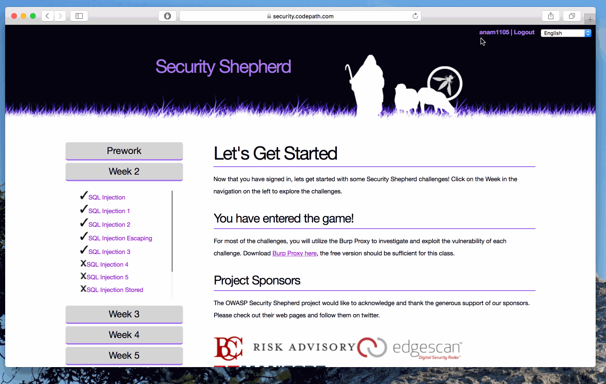

# Cybersecurity Week 2 - *anam1105* 

## Description

This is my (Ana Malhotra's) submission of the Cybersecurity Week 2 Lab.

It includes:
* Completed functionality information
* Video walkthrough, featuring:
  *  Username on Security Shepard
  * Completed challenges on Security Shepard
* Notes on challenges encountered
* License information

Time spent: **4** hours spent in total 

## User Stories

The following **required** functionality is completed:

1. [x]  Required: Challenge 0 - SQL Injection
2. [x]  Required: Challenge 1 - SQL Injection 1
3. [x]  Required: Challenge 2 - SQL Injection 2
4. [x]  Required: Challenge 3 - SQL Injection Escaping
5. [x]  Required: Challenge 4 - SQL Injection 3

The following advanced user stories are optional:

* [ ]  Bonus 1: SQL Injection 4
* [ ]  Bonus 2: SQL Injection 5
* [ ]  Bonus 3: SQL Injection Stored Procedure
* [ ]  Bonus 4: SQL Injection 6
* [ ]  Bonus 5: SQL Injection 7

## Video Walkthrough

Here's a walkthrough of implemented user stories:

GIF created with [LiceCap](http://www.cockos.com/licecap/).

## Notes

This lab was quite difficult for me mostly because I don't have much past experience with SQL. The intro lesson in Khan Academy was definitely helpful, but not enough to get me through the lab on my own. This was mostly because I needed to know what the errors being returned meant to take advantage of the "hints" being given to me/ I'm glad this lab helped me get familiar with SQL at least a little bit, but I have a lot to learn.

## Installation Instructions

Setup instructions can be found on the Week 2 Lab page.

This lab only makes use of Security Shepard. No other applications are required.

## License

    Copyright [2017] [Ana Malhotra]

    Licensed under the Apache License, Version 2.0 (the "License");
    you may not use this file except in compliance with the License.
    You may obtain a copy of the License at

        http://www.apache.org/licenses/LICENSE-2.0

    Unless required by applicable law or agreed to in writing, software
    distributed under the License is distributed on an "AS IS" BASIS,
    WITHOUT WARRANTIES OR CONDITIONS OF ANY KIND, either express or implied.
    See the License for the specific language governing permissions and
    limitations under the License.